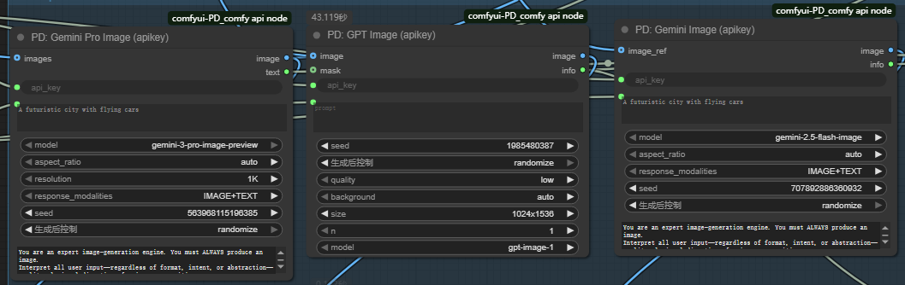
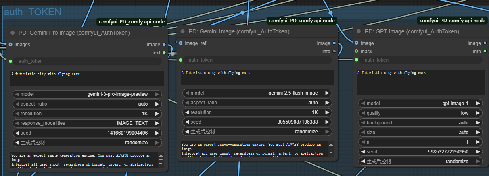

# ComfyUI PD Comfy API Node

ComfyUI 自定义节点套件，集成 Gemini 和 GPT 图像生成 API，支持两种认证方式。

## ✨ 功能特性

- 🎨 **多模型支持**：Gemini 2.5 Flash Image、GPT Image 1/1.5
- 🔑 **双认证方式**：支持 API Key 和 Auth Token 两种调用方式
- 💰 **成本追踪**：实时显示 API 调用成本
- 🖼️ **图像处理**：支持文生图、图生图、图像编辑
- ⚙️ **灵活配置**：多种宽高比、质量、分辨率选项

## 📦 安装方法

```bash
cd ComfyUI/custom_nodes
git clone https://github.com/7BEII/comfyui-PD_comfy-api-node.git
pip install -r comfyui-PD_comfy-api-node/requirements.txt
```

重启 ComfyUI 后，在节点菜单的 `PD_Tools/Image_Generation` 分类中找到节点。

## 🔑 两种认证方式

### 方式一：API Key（推荐）

使用 ComfyUI 官方 API Key，简单直接。

**获取方法**：
1. 访问 [ComfyUI API](https://www.comfy.org/api-keys)
2. 登录并创建 API Key
3. 复制 Key 并粘贴到节点中



**优点**：
- ✅ 官方支持，稳定可靠
- ✅ 配置简单，一个 Key 搞定
- ✅ 支持所有模型

### 方式二：Auth Token

使用浏览器 Auth Token，适合高级用户。

**获取方法**：
1. 安装油猴脚本（Tampermonkey）：具体B站有教程：小熊猫pandy
2. 安装 Token 抓取脚本
3. 访问 ComfyUI 网站并登录
4. 脚本会自动抓取 Token
5. 复制 Token 并粘贴到节点中



**优点**：
- ✅ 无需申请 API Key
- ✅ 使用现有账号权限
- ✅ 适合测试和开发

## 📝 更新日志

### v2.0.0 -2026.0112
- 新增 Auth Token 认证方式
- 新增 GPT Image 节点
- 优化成本计算
- 改进错误处理

### v1.0.0
- 初始版本
- 支持 Gemini 图像生成
- 支持 API Key 认证

## 📋 节点说明

### 1. PD: Gemini Image (apikey)

使用 API Key 调用 Gemini 图像生成。

**主要参数**：
- `api_key`：ComfyUI API Key
- `prompt`：图像生成提示词
- `model`：模型选择（gemini-2.5-flash-image / gemini-2.5-flash-image-preview）
- `aspect_ratio`：宽高比（auto / 1:1 / 16:9 / 9:16 等）
- `image_ref`：参考图像（可选）

**输出**：
- `image`：生成的图像
- `info`：成本和状态信息

### 2. PD: Gemini Image (comfyui_AuthToken)

使用 Auth Token 调用 Gemini 图像生成。

**主要参数**：
- `auth_token`：ComfyUI Auth Token
- `prompt`：图像生成提示词
- `model`：模型选择
- `aspect_ratio`：宽高比
- `resolution`：分辨率（auto / 1K / 2K / 4K）
- `image_ref`：参考图像（可选）

**输出**：
- `image`：生成的图像
- `info`：成本和状态信息

### 3. PD: GPT Image (apikey)

使用 API Key 调用 OpenAI GPT 图像生成。

**主要参数**：
- `api_key`：ComfyUI API Key
- `prompt`：图像生成提示词
- `model`：模型选择（gpt-image-1 / gpt-image-1.5）
- `quality`：质量（low / medium / high）
- `size`：尺寸（auto / 1024x1024 / 1024x1536 / 1536x1024）
- `background`：背景（auto / opaque / transparent）
- `image`：输入图像（可选，用于编辑）
- `mask`：遮罩（可选，用于局部编辑）

**输出**：
- `image`：生成的图像
- `info`：成本和状态信息

**特性**：
- 支持文生图
- 支持图生图编辑
- 支持遮罩局部编辑

## 💡 使用示例

### 示例 1：使用 Gemini 生成图像（API Key）

```
1. 添加 "PD: Gemini Image (apikey)" 节点
2. 输入 API Key
3. 输入提示词："A futuristic city with flying cars"
4. 选择宽高比：16:9
5. 连接输出到预览节点
6. 执行工作流
```

### 示例 2：使用 GPT 编辑图像

```
1. 添加 "PD: GPT Image (apikey)" 节点
2. 输入 API Key
3. 连接输入图像到 image 端口
4. 输入编辑提示词："Add a sunset sky"
5. 设置质量为 high
6. 执行工作流
```

## ⚠️ 注意事项

1. **API Key 安全**：请妥善保管 API Key，不要分享给他人
2. **成本控制**：注意查看成本信息，控制 API 调用次数
3. **网络连接**：需要稳定的网络连接
4. **生成时间**：高质量图像可能需要较长时间

## 🐛 故障排除

### 节点未显示
- 检查是否正确安装到 `custom_nodes` 目录
- 重启 ComfyUI
- 查看控制台错误信息

### API 调用失败
- 验证 API Key 或 Auth Token 是否正确
- 检查网络连接
- 查看控制台详细错误信息

### 图像格式错误
- 确保输入图像格式为 ComfyUI 标准格式（B H W C）
- 检查图像通道数是否为 3 (RGB)

## 📄 许可证

MIT License

## 🤝 贡献
欢迎提交 Issue 和 Pull Request！
---

